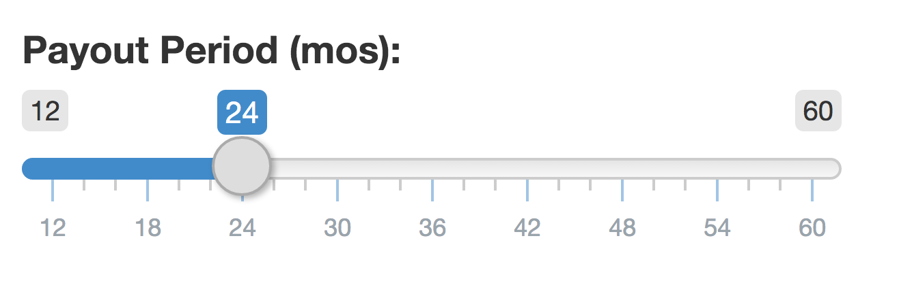
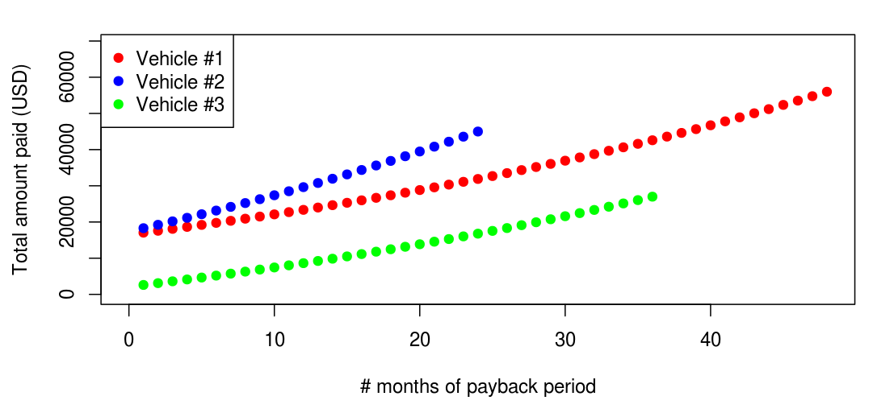

myCalculator
========================================================
author: Kevin Stanford
date: 28 Feb 2016
transition: rotate
font-family: Verdana

Overview
========================================================

This calculator allows the user to compare up to three different potential vehicle purchases to see how price, tax and interest rates, and payback period affect:

- Monthly Payment
- Total Loan Amount

Payback Period Selector
========================================================

The slider tool allows the user to select payback period of 12 to 60 months in six-month increments.




Payment Amount Calculation
========================================================

Payment amount is calculated using the _pmt()_ function in library _FinCal_

```r
library(FinCal)

pmt((3.9/100)/12   # Annual Percentage Rate 
                    # divided by 12 for 
                    # monthly payments
    ,60            # Payback period (months)
    ,28000         # Amount to be financed
    ,0.0           # Amount due at end of
                    # payback period -- 
                    # 0 indicates completely
                    # paid off
)
```

```
[1] -514.4
```

Payment Plan Comparison
========================================================

Plot visualizes payments for each vehicle option over the enitre length of the payback period.


